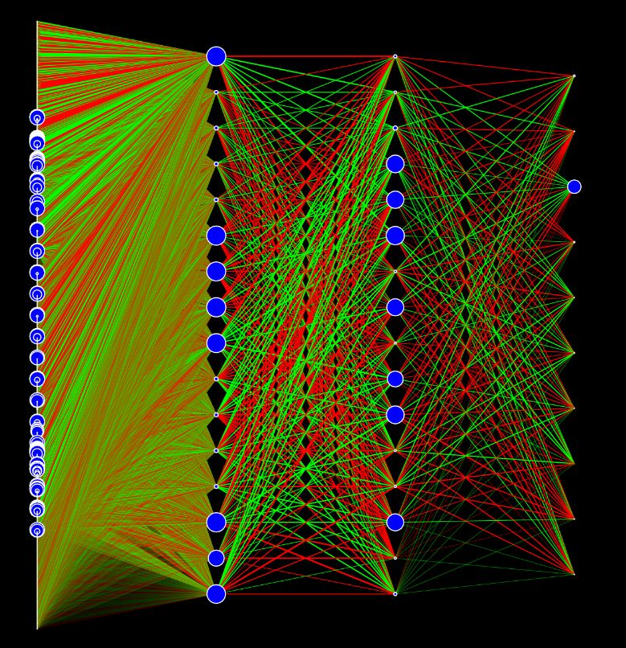

# Neural-Network-MNIST

This a javascript implementation of a fully connected feedforward neural network.
I did not use any machine learning libraries, the whole network structure, backpropagation, batching, and gradient descent are implemented from the ground up.

I trained it on the MNIST dataset and obtained over 97% accuracy (in ~10 minutes of training).

I also visualised the network with the actual activation data: the width of the connections is proportional with their weight (green is positive and red is negative), the radius of the neurons is proportional with the absolute value of their activation.

